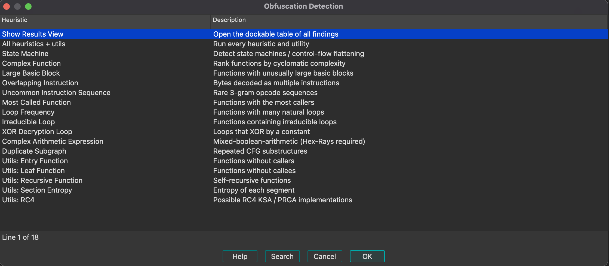

# Obfuscation Detection for IDA Pro

> Port of [mrphrazer/obfuscation_detection](https://github.com/mrphrazer/obfuscation_detection)
> by [Tim Blazytko](https://github.com/mrphrazer). Original targets Binary Ninja;
> a Ghidra version lives at [mrphrazer/obfuscation_detection_ghidra](https://github.com/mrphrazer/obfuscation_detection_ghidra).

Same idea as the original: run a bunch of heuristics that tend to light up
on obfuscated, packed, or crypto-heavy binaries. Matched functions get a
repeatable comment tagging why they were flagged, findings that pinpoint
a specific instruction get annotated on that line in both the disassembly
and Hex-Rays pseudocode, overlapping instructions get highlighted, and
everything is dumped to the Output window.

## What it looks for

Heuristics:

* State machines / control-flow flattening
* High cyclomatic complexity
* Unusually large basic blocks
* Overlapping instructions (bytes disassembled two different ways)
* Rare 3-gram opcode sequences vs reference tables for x86, x86_64, ARM, AArch64
* Popular helpers (things called from lots of places, common for string decrypt)
* Functions with many natural loops
* Irreducible loops
* XOR-by-constant inside a loop
* Mixed boolean-arithmetic (needs Hex-Rays)
* Repeated CFG subgraphs

Utilities:

* Entry / leaf / recursive functions
* Section entropy
* RC4 KSA and PRGA candidates

## Install

Drop the loader (`obfuscation_detection.py`) and its package
(`obfuscation_detection_ida/`) into your IDA user plugins directory.

### Linux / macOS

```
~/.idapro/plugins/obfuscation_detection.py
~/.idapro/plugins/obfuscation_detection_ida/
```

### Windows

```
%APPDATA%\Hex-Rays\IDA Pro\plugins\obfuscation_detection.py
%APPDATA%\Hex-Rays\IDA Pro\plugins\obfuscation_detection_ida\
```

Restart IDA. You should see `[obfdet] Obfuscation Detection 1.0 loaded.` in
the Output window. The plugin adds a single entry under
**Edit > Plugins > Obfuscation Detection** that opens a picker with every
heuristic (including "All heuristics + utils" and "Show Results View").

## Using it

Click **Edit > Plugins > Obfuscation Detection**, then double-click a
heuristic in the picker.


 Open **Show Results View** once at the start of a
session to get a dockable table that accumulates findings as you go;
double-clicking a row jumps IDA to that address.

From the IDAPython console:

```python
from obfuscation_detection_ida import (
    run_all,
    run_heuristics,
    run_utils,
    find_state_machines,
    find_xor_decryption_loops,
)

run_all()
```

Function-level findings are appended to the function's repeatable comment
as lines like `[obfdet] Heuristic: State Machine: ...`. Findings that
pinpoint a specific instruction (XOR loops, RC4 KSA/PRGA constants,
overlapping bytes) also drop a matching comment on that exact line, which
Hex-Rays shows on the corresponding pseudocode statement. Everything is
grep-friendly, survives IDB saves, and re-running a heuristic replaces its
prior comment instead of stacking duplicates.

## Notes about the port

A few things differ from the Binary Ninja original because IDA's SDK doesn't
expose the same primitives:

* No first-class tag types in IDA. Findings go into the function's
  repeatable comment (and the per-instruction disasm/pseudocode comment
  for site-specific findings), all prefixed with `[obfdet]`.
* Dominators, dominance frontiers, and back-edge detection are computed
  by the plugin (Cooper-Harvey-Kennedy). IDA's `FlowChart` doesn't hand
  those to you.
* XOR-in-loop and RC4 PRGA detection run on assembly mnemonics rather than
  a lifted IL, since IDA has no LLIL equivalent that's usable without the
  decompiler. Common `xor`/`eor` patterns are caught; XOR expressed via
  lifted arithmetic is not.
* Mixed-boolean-arithmetic detection uses Hex-Rays microcode at
  `MMAT_LVARS`. If the decompiler isn't installed the heuristic returns 0
  for every function rather than blowing up. Absolute counts aren't
  comparable to the Binary Ninja HLIL-based scores, but the ranking is.
* The uncommon-instruction-sequence heuristic only runs on x86, x86_64,
  ARM, and AArch64. Other architectures are skipped with a message
  instead of falling through to the LLIL n-gram database (which we can't
  compute in IDA).
* Results view is a Qt dock; PySide6 / PySide2 / PyQt5 are tried in that
  order. Without any of them the plugin still tags functions and prints
  to the Output window.

## Credit

All the actual research and heuristics come from Tim Blazytko's original
[obfuscation_detection](https://github.com/mrphrazer/obfuscation_detection).
