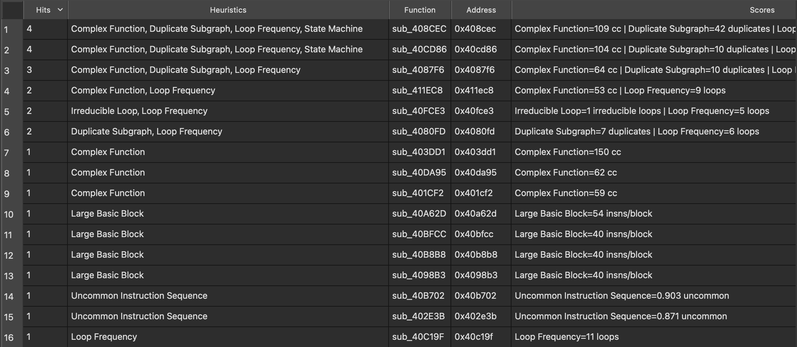

# Obfuscation Detection for IDA Pro

> Port of [mrphrazer/obfuscation_detection](https://github.com/mrphrazer/obfuscation_detection)
> by [Tim Blazytko](https://github.com/mrphrazer).

Same idea as the original but for IDA Pro. Flagged functions get a comment saying why they were flagged. Findings tied to a specific instruction also get a comment on that line. Results show up in a table and get logged to the Output window.

## What it looks for

The plugin flags functions whose shape suggests something interesting is
going on: obfuscated control flow, state machines and protocol
dispatchers, C2 communication, string or code decryption stubs, and
hand-rolled cryptography. Each heuristic scores functions on a different
signal, and the results table ranks by how many independent heuristics
hit the same function, so real obfuscation floats above one-off matches.

Heuristics:

* State machines / control-flow flattening
* High cyclomatic complexity
* Unusually large basic blocks
* Overlapping instructions (bytes decoded as more than one instruction)
* Rare 3-gram opcode sequences (scored against a reference table per arch)
* Popular helpers (functions called from many places, often string decryptors or API-hash resolvers)
* Functions with many natural loops
* Irreducible loops
* XOR-by-constant inside a loop
* Mixed boolean-arithmetic
* Repeated CFG subgraphs (cloned obfuscation stubs, unrolled loops)
* Basic-block splitting (high blocks-per-branch ratio)

Utilities:

* Entry / leaf / recursive functions
* Section entropy
* RC4 KSA and PRGA candidates

## Install

Drop `obfuscation_detection.py` and `obfuscation_detection_ida/` into your IDA plugins directory.

### Linux / macOS

```
~/.idapro/plugins/obfuscation_detection.py
~/.idapro/plugins/obfuscation_detection_ida/
```

### Windows

```
%APPDATA%\Hex-Rays\IDA Pro\plugins\obfuscation_detection.py
%APPDATA%\Hex-Rays\IDA Pro\plugins\obfuscation_detection_ida\
```

Restart IDA. You should see `[obfdet] Obfuscation Detection 1.0 loaded.` in
the Output window.

## Usage 
The plugin adds an entry under
**Edit > Plugins > Obfuscation Detection**. Launching it opens the dockable
results table and a menu pops up listing every heuristic. Pick one to run
and its findings populate the same table.


The results table has one row per function, sorted by how many heuristics
fired. Double-clicking a row jumps to that function. **Configure: Findings
Cap** in the chooser adjusts the per-heuristic result cap (default 30).



Findings are added as a comment: `[obfdet] Heuristic: State Machine: ...`. 

Comments can be mass-removed by selecting the `Clear all [obfdet] comments` option.

## Notes about the port

A few things differ from the Binary Ninja original because IDA's SDK
doesn't give you the same primitives:

* IDA has no first-class tag types. Findings land in function and
  instruction comments, prefixed with `[obfdet]`.
* Dominators, dominance frontiers, and back-edge detection are computed
  inside the plugin (Cooper-Harvey-Kennedy). IDA's `FlowChart` doesn't
  give you any of that.
* XOR-in-loop and RC4 PRGA detection walk assembly mnemonics rather than
  a lifted IL. IDA has no LLIL equivalent that works without the
  decompiler, so plain `xor` / `eor` patterns get caught but anything
  hidden inside a lifted arithmetic identity does not.
* Mixed-boolean-arithmetic detection uses Hex-Rays microcode at
  `MMAT_LVARS`. Without Hex-Rays it prints a warning and skips the
  heuristic. `gen_microcode` has crashed IDA on some Go binaries during
  testing, so MBA is left out of `run_all`; run it on its own from the
  chooser when you want it.
* Uncommon-instruction-sequence only runs on x86, x86_64, ARM, and
  AArch64. Other architectures get a "no n-gram table" message and are
  skipped rather than falling through to something meaningless.
* The results dock tries PySide6, then PySide2, then PyQt5. If none of
  them import, the plugin still tags functions and logs to the Output
  window; only the dock is unavailable.